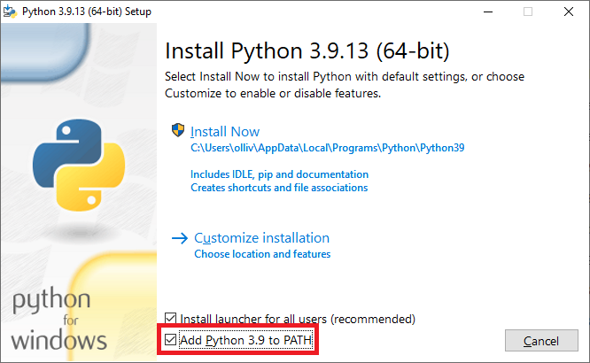

# 🐍 Lecture 1: Introduction to Python Programming 📐

## What is Python? 🤔

Python is a powerful, easy-to-learn programming language that’s used by professionals across a wide range of industries—from web development and data science to automation and engineering. Its simplicity and versatility make it the perfect tool for beginners and experts alike. Whether you're looking to automate repetitive tasks, analyze data, or develop complex applications, Python has got you covered! 💻

## Why Python? 🎯

Here’s why Python is an excellent choice, especially in the field of civil engineering:

### 1. **Easy to Learn and Use** 🧑‍🎓
Python’s clean and straightforward syntax means you can focus on solving problems without getting bogged down by complex code. This makes it a great starting point for anyone new to programming, especially when you’re more interested in solving engineering challenges than writing intricate code.

### 2. **Vast Libraries and Tools** 📚
Python has a rich ecosystem of libraries that can help you with everything from numerical analysis (using **NumPy** and **SciPy**) to data visualization (with **Matplotlib** and **Plotly**). This means you don’t have to reinvent the wheel—you can leverage existing tools to get your work done faster and more efficiently.

### 3. **Automation and Efficiency** ⚙️
In civil engineering, repetitive tasks like data entry, calculations, and report generation can eat up a lot of your time. Python allows you to automate these tasks, freeing up your time for more critical thinking and problem-solving. Imagine writing a script that automatically calculates and logs the load-bearing capacity of various structures—sounds like a time-saver, right? ⏱️

### 4. **Data Analysis and Visualization** 📊
Civil engineers deal with massive amounts of data, whether it’s soil analysis, traffic patterns, or material properties. Python can help you organize, analyze, and visualize this data effectively. You can create graphs, charts, and even 3D models to better understand and present your findings.

### 5. **Interoperability** 🔄
Python can easily integrate with other software and systems you might already be using in your civil engineering projects, such as AutoCAD or BIM tools. This means you can enhance your existing workflows with the power of Python without starting from scratch.

---
# How to Get Started with Python 🚀

Ready to start your Python journey? Here’s what you need to do:
First, we install the Python interpreter. The Python interpreter is a program that translates the Python language
statements in a program one at a time into instructions
accepted by the computer's central processing unit (CPU).

The installation of the Python interpreter proceeds as follows:

1. Navigate to https://www.python.org/downloads/ with your browser.
2. Select **Downloads / All releases**.
3. Scroll to the section titled **Looking for a specific release?**.
   Click Download for the version of your choice (any version between 3.7.X and 3.9.X should do). The minor revision number
   X can be any number.
4. Download the Python interpreter by clicking the link *Windows installer (64-bit)* at the bottom of the page.
   The wizard will guide you in the installation process. It is recommended to use the default folder for the installation.

**Important:** The guided installation process provides the opportunity to add
the Python interpreter to the `PATH` environment variable in the Windows operating
system. This environment variable contains a list of directories that the operating
system automatically searches for executable programs. Adding Python to the `PATH`
is recommended because it allows you to use the `python` command from any directory
in the command prompt, and the Python interpreter will be found automatically.
(This is beneficial for the upcoming Hardware 1 and 2 courses, where Python is also used.)

The following image shows the checkbox from which the addition is made:

